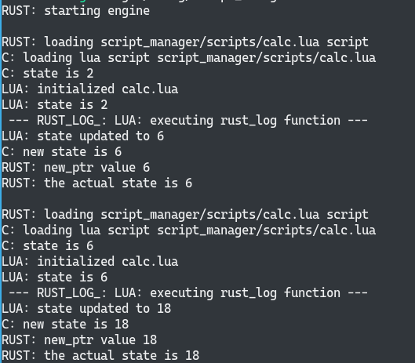
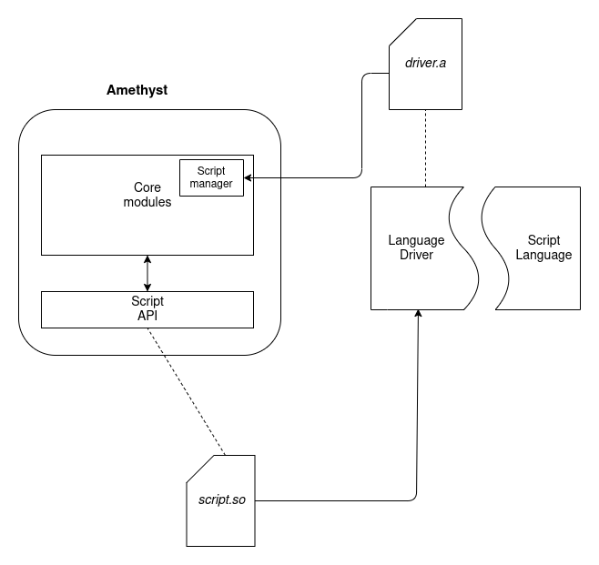

# Rust-Scripting
Repository with boilerplate for experimenting with scripting in Rust.

# Before running
We are using Lua language as scripting language, and for that we build the lua source code before interpreting it, so after cloning the repo you should update our git submodule too.
```bash
$ git submodule init
$ git submodule update
```
Now you will have Lua lang cloned in version 5.3.5 inside our `script_manager/lua/src` folder.

# Running the example

To run and build the experiment you should use Cargo:
```bash
$ cargo build
$ cargo run
```

# What is happening

When this repo runs smoothly you should see this:



Each printed line starts with the programming language of the file that is printing that log.   
In this project we have a Rust "game engine" (Just a loop for now) which loads scripts, executes them and maintain a game state (an Integer) in Rust. While also exposing and sharing functions and methods between the scripting language and Rust.

This is a prototype to validate and exemplify how to expose Rust functions to a scripting language using a C language driver, while maintaining a Rust state.

## Modules
### Scripting API
The Scripting API module is responsible for exposing Rust structs and functions to C, this is done via Foreign Function Interface (FFI) and will define which Rust resources will be available to the scripting language.

We use the `Extern 'C'` directive to expose Rust code with C binds, basically `.h` and `.o` files. With this in mind, we use cargo lib builder with `cdylib` mode, which will generate a `.so` shared dynamic library to be used by C in each language driver.

This scripting `.so` will be the main input for the rest of the modules and is built before everything.

### Language Drivers

The language Driver is the interface between languages, it will receive the shared library from the Scripting API with Rust functions and structs, and be responsible for compiling/interpreting each language, so you are going to need one Language driver for each language desired to be a scripting language. 

The language driver should be written in C, because Rust already has good compatibility with its FFI, and C by itself already has many connectors to run other languages.

Here we have a Lua interpreter as an example in `script_manager/drivers/`, but any language that can be interpreted/compiled with C should be possible to be run here. 

### Script Manager 

This module manages the load and execution of each script inside the "engine". It builds all the Language Drivers on `build.rs` and uses them to load and execute all scripts in the main function which is simulating a game loop.

## Module Integration to another Rust Software

We are using this prototype to plan and integrate a Scripting System for the [Amethyst Game Engine](https://github.com/amethyst/amethyst). However, this architecture should be similar for another projects too:

